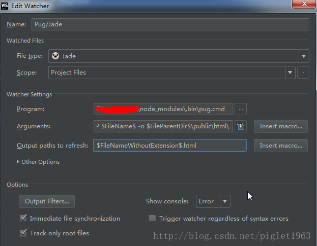

# 

# 什么是[巴哥](https://pugjs.org/zh-cn/api/getting-started.html)?为什么使用巴哥?
    Pug，原名 Jade， 是一个很流行的 HTML 模板引擎，后来由于 Jade 被注册为商标的原因，改名为 Pug
    按照pug语法去编写页面结构可以大大加速网页开发效率,省去了标签组合等书写.而且对vue支持很友好!
----------------------------------------
# 配置npm淘宝镜像
    `npm install -g cnpm `
    配置之后就可以使用cnpm代替npm进行包安装,可以提高安装速度
----------------------------------------

# 怎么安装?
### 先全局安装(基于node环境进行全局安装)
+ `` npm install pug -g ``
+ `` npm install pug-cli -g   cli的意思是脚手架,就是省事的工具``  
+ ``在控制台输入命令 pug pug文件 -w 可以自动生成.html文件(-w是监听模式:热更新)``
    - vscode 
        + 插件名:Pug(Jade) snippets 和 Pug beautify
    - sublime 
        + ctrl+shift+P 打开命令窗口
        + 输入package install
        + 输入 pug 选择第一个安装
    - webstorm
        + 打开设置,搜索: watcher
        + 
----------------------------------------

# 怎么用(模板初次转换)?
#### 1 创建:吴彦祖最帅`.pug`文件
#### 2 添加文件内容:(注意换行的缩进),这是一个最基本的html结构
    doctype
    html
    header
        style.
        #box{
            background:green;
        }
    body
        div#box 你好,我是吴彦祖!
#### 3 在该.pug文件所在文件夹下 shift+鼠标右键 打开cmd窗口, 输入
    pug 吴彦祖.pug
#### 4 此时就可以在同级文件夹中看到动态创建出的 吴彦祖.html文件, 打开文件检查
### 编译文件语法
    编译 A 文件夹下所有模板
    pug A

    编译 A 文件夹下和 B 文件夹下的模板至 C 文件夹（绝对路径）
    pug A B --out /C

    编译 A.pug 并美化 html 代码
    pug A.pug -P
#### 5 检查成功,说明配置OK啦!
----------------------------------------

# 到底怎么用?
### 语法:
#### 0 pug 省略标签的<>,双标签会自动闭合 , 并且使用缩进代表层级关系，标签中的内容用空格与标签名分离.
    `
    doctype
        html
        header
            style.
            #box{
                background:green;
            }
        body
            div#box 你好,我是吴彦祖!
    `
#### 1 ``单标签支持自闭合/或者在尾部加斜线'/'``
    `
        input(type="text")/
    `
#### 2 ``标签属性-用小括号包裹,内容正常写,多个属性用逗号或者空格分隔``
    `
        span(class="wyzzs") 吴彦祖最帅
    `
#### 3 ``如果标签内文本包含标签,需要写尖括号``
    `
        p#text js是<strong>最好</strong>的语言
    `
#### 4 ``注释``
    + 编译到文件中的注释:  //
    + 不编译到文件中的注释: //-
    + 块级注释: 
            // 换行
                注释内容1
                注释内容2
#### 5 ``类名(重点): 类名可以使用数组或者对象,与Vue的语法相似,提前记忆!``
    ``
        span(class=['a' , 'b' , 'c'])
        或者
       span(class={ 'a':true , 'b':false })
    ``
###### 6 变量(了解): 因为在Vue中有提供,所以pug中暂不用使用变量.

###### 7 循环和分支(了解): 类似emit语法中 ul>li*3 可以创建3个li,因为在Vue中可以使用v-for和v-if进行创建结构,暂时不用记.
    ``
        ul
            each val in [1,2,3,4,5]
                li #{val + 'index' + index}
    ``
### 8 ``pug文件引入- ***include XX.pug***,搭积木,相当于less语法中的@import,可以拼接结构内容``
+ (***如果引入不是pug文件,则作纯文本显示***)  
    ``
        doctype html
        html
            include header.pug
            body
                div#box(data-name="testBox") 内容...
----------------------------------------
# Vue中怎么用?
``(记住Vue开始了之后在这里可以按步骤去使用,)现在看不懂没关系``
在 Vue 的单文件组件中的 <template> 中可以使用 Pug 进行模板的编写（JADE步骤相同）
首先安装 Pug 依赖
### 安装依赖
*``npm install pug pug-loader pug-filters -D``    安装pug插件,对应loader和其他相关处理文件(XX-loader是某类型文件的编译文件)*
### 在webpack.config中.js文件中modules选项配置规则
*`{
  test: /\.pug$/,
  loader: 'pug'
}`*
### 此时可以在.vue文件中使用pug语法了